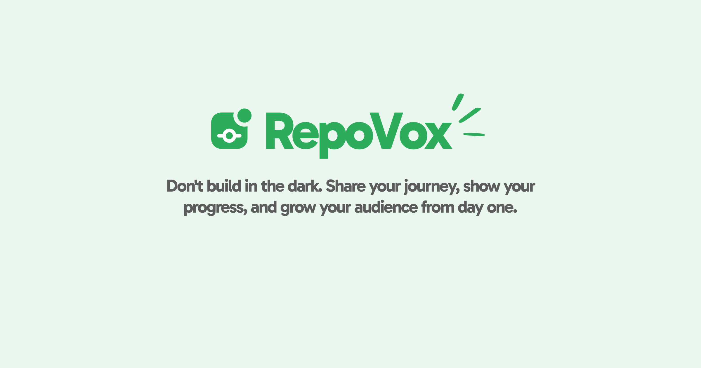

## Overview

**RepoVox** is an AI-powered assistant that helps developers, team leads, and indie hackers streamline code reviews, summarize commits, and share technical updates on social media directly from their repositories. It's designed to integrate seamlessly with GitHub, offering both personal productivity and team collaboration features.

## Features

- ✨ **AI-generated Code Summaries**  
  Automatically summarize pull requests, commits, and code changes using OpenAI.
- 📬 **Social Media Publishing**  
  Share your summarized updates on platforms like LinkedIn, Twitter, and Dev.to with one click.
- 🔄 **Real-time GitHub Sync**  
  RepoVox stays in sync with your repositories, tracking branches, issues, and merges.
- 💬 **Comment Suggestions for PRs**  
  Get smart suggestions for PR comments to speed up reviews.
- 📊 **Team Dashboard (Coming Soon)**  
  A centralized place for teams to see review progress and contributions.

## Tech Stack

- **Frontend:** Next.js
- **Backend:** Prisma ORM
- **AI:** OpenAI GPT (Summarization, NLP)
- **Database:** Postgreql
- **DevOps:** GitHub Actions/Apps

## My Role

I was responsible for designing the end-to-end architecture, building both mobile and web platforms, and integrating AI features for commit analysis and summarization. I also built the GitHub App used to install RepoVox on user repositories.

## Challenges Solved

- Mapped raw GitHub diffs to clean, human-readable summaries using token-aware AI prompts.
- Ensured seamless syncing with GitHub using OAuth and webhooks.
- Built a unified publishing flow for multiple social networks using content templates.

## How It Works

### 🛠 Step 1: Connect Your GitHub Repository

- Authenticate with GitHub.
- Install the RepoVox GitHub App on selected repositories.
- Grant necessary read/write access for pull requests and commit metadata.
- Select the repository
- Setup trigger
  - Choose branch
  - Select Action
  - Select the Post To (Platform)

### 🔔 Step 2: Listen for Code Events

- RepoVox sets up GitHub webhooks to listen for:
  - Push events (commits)
  - Pull request events (opened, updated, merged)
  - Tag and release events (optional)

### 🧠 Step 3: Analyze the Code Changes

- The app fetches the diff for relevant files in a PR or commit.
- Noise like whitespace changes or lockfile updates is filtered out.
- Only meaningful changes are processed.

### 🤖 Step 4: Generate AI Summaries

- Code changes are passed to an AI model (OpenAI/GPT).
- The model summarizes:
  - What changed
  - Why it matters
  - Any notable impact (e.g., breaking changes, refactors)
- Summaries are returned in markdown or bullet list formats.

### ✍️ Step 5: User Review & Edit

- Users can:
  - View the AI-generated summary in the web UI
  - Edit or regenerate it
  - Accept or reject summaries

### 📣 Step 6: Share to Social Media (Optional)

- Once a summary is approved, users can:
  - Select a post template
  - Include tags, emojis, links
  - Publish to Twitter, LinkedIn, or blogging platforms

### 📊 Step 7: Track History and Performance

- All generated content is saved.
- Admins can:
  - View past summaries
  - Audit AI content vs manual edits
  - Export or integrate with Slack or email digests

## Demo

🌐 [Visit Live Project](https://repovox.com)

---
